# 🐾 Sistema de Gestión Veterinaria — Proyecto Fullstack Personal

Este proyecto fue desarrollado desde cero con enfoque fullstack, aplicando las mejores prácticas en diseño de interfaces, arquitectura backend y gestión de datos. Fue construido con el objetivo de simular un sistema real de gestión para clínicas veterinarias, destacando **autenticación por roles**, **flujo completo de citas**, y **historial médico**.

---

## 🎯 Objetivo del proyecto

Diseñar y desarrollar una solución completa que permita gestionar una veterinaria, incluyendo usuarios, mascotas, citas, y notas clínicas. Este proyecto fue pensado para demostrar mi interes y capacidad de:

- Construir interfaces responsivas y funcionales en React
- Diseñar APIs REST seguras con Express
- Modelar relaciones de base de datos reales en MySQL
- Implementar flujos completos con validaciones, roles y protección JWT
- Pensar como un desarrollador de producto

---

## 🛠️ Tecnologías utilizadas

### Frontend
- ⚛️ React con TypeScript y Vite
- 🎨 TailwindCSS para diseño responsivo
- 🔄 Axios para consumo de API
- 📍 React Router DOM para navegación dinámica

### Backend
- 🚀 Node.js + Express
- 🔐 Autenticación con JSON Web Tokens (JWT)
- 🗄️ Base de datos MySQL con relaciones reales (JOINs, UUIDs, claves foráneas)
- 🧱 Arquitectura modular: rutas, controladores, middlewares

---

## 🧠 Capacidades demostradas

✔️ Desarrollo fullstack moderno (frontend + backend)  
✔️ Gestión de roles y control de acceso  
✔️ Diseño de base de datos relacional  
✔️ Flujo completo de agendamiento y confirmación de citas  
✔️ Implementación de historial médico por mascota  
✔️ Validación de datos, protección de rutas y seguridad básica  
✔️ Experiencia real en control de versiones con Git y GitHub  

---

## 🚀 Funcionalidades principales

- Registro e inicio de sesión con control de sesión vía JWT
- Panel dinámico según el rol: Usuario o Veterinario
- Agendamiento, confirmación, cancelación y seguimiento de citas
- Historial médico vinculado por mascota
- Notas clínicas por parte del veterinario
- Redirección automática al dashboard correcto
- Cierre de sesión seguro y controlado

- ## 🖼️ Capturas de pantalla

### 🏠 Pantallas de inicio


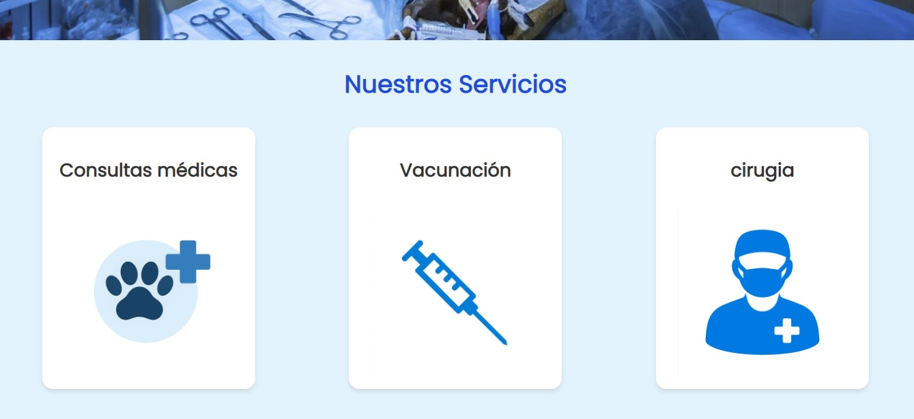

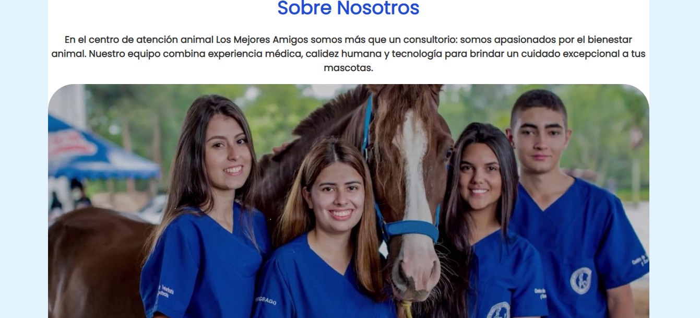
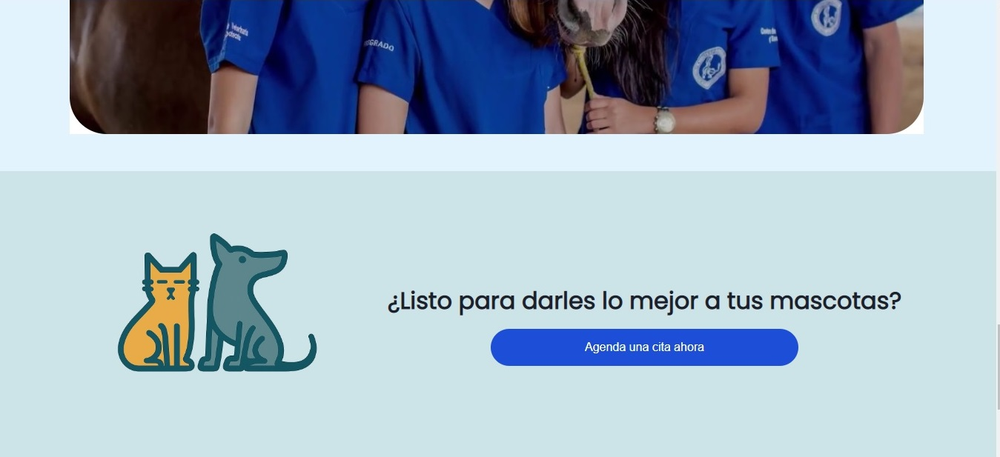
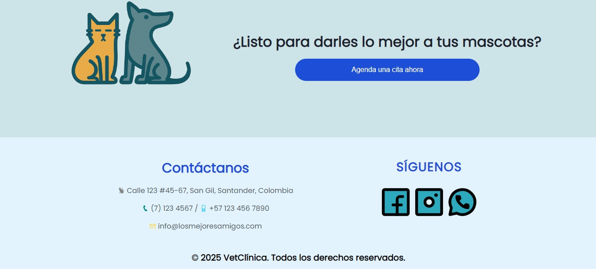

### 🔐 Login y administración

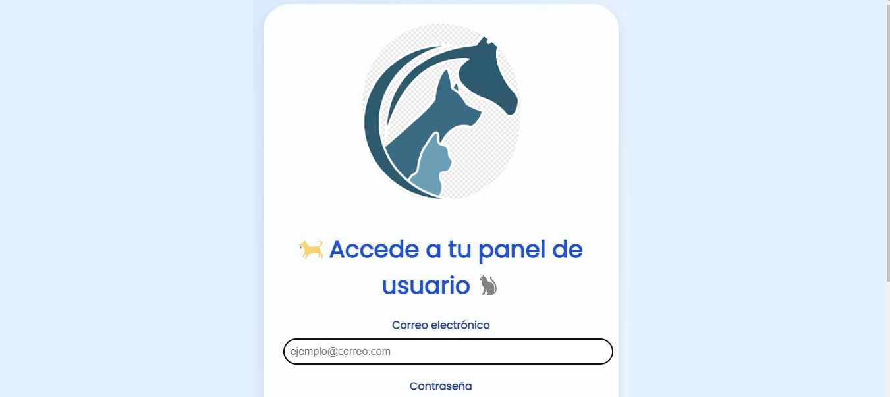

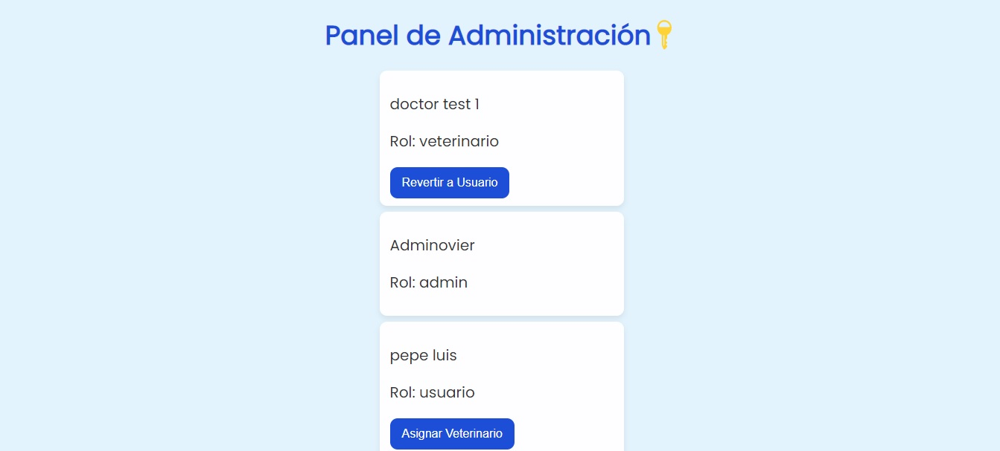

### 👤 Módulo de usuario

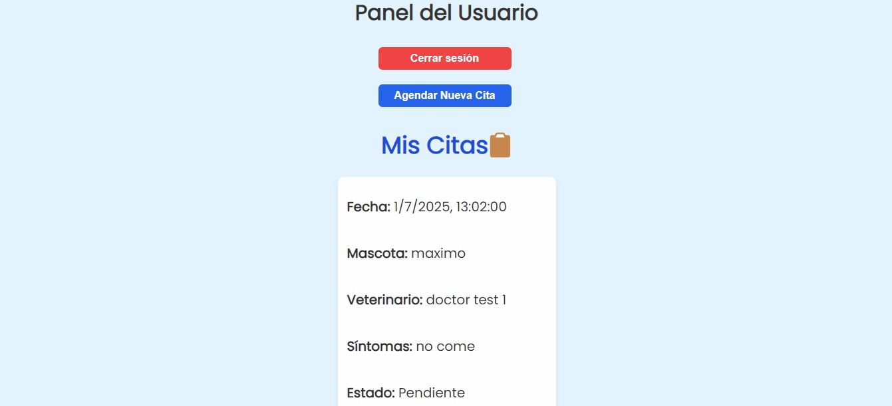

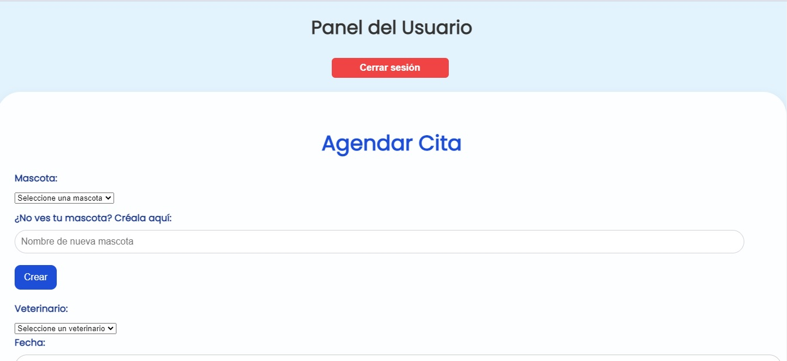
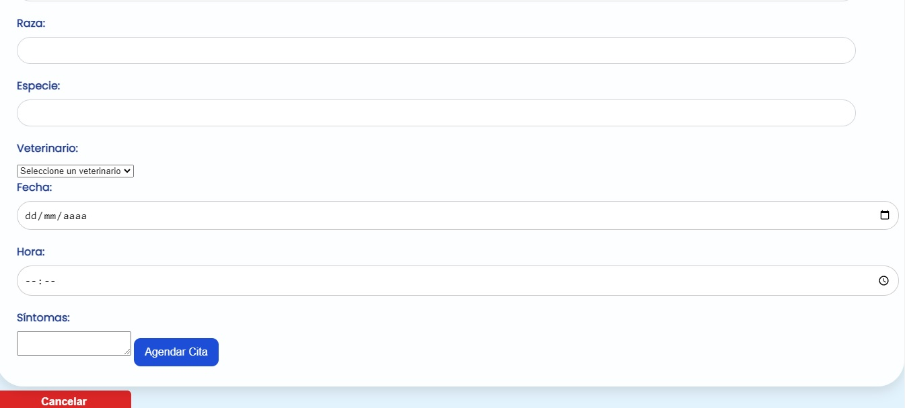

### 🧑‍⚕️ Módulo del veterinario

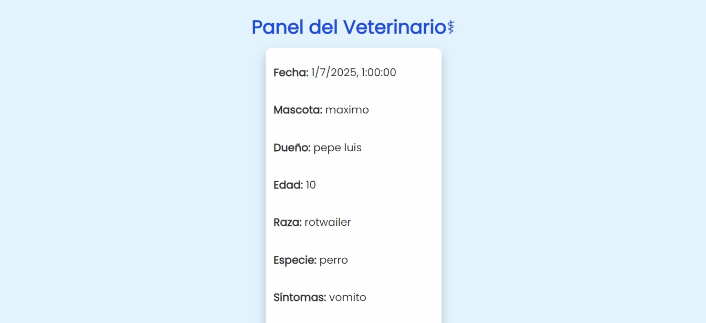
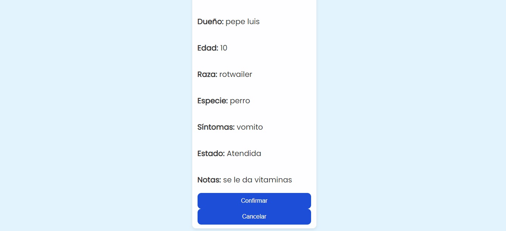
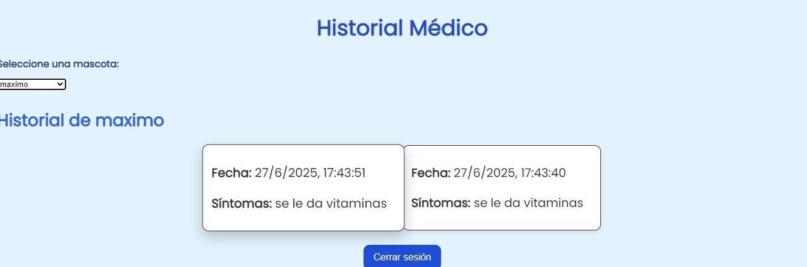

---

## 📦 Instalación local

### Backend (Express + MySQL)

```bash
cd backend
npm install
node server.js


## 📝 Licencia
Este proyecto está bajo la **licencia MIT**. Puedes modificar y distribuir el código con fines no comerciales.
